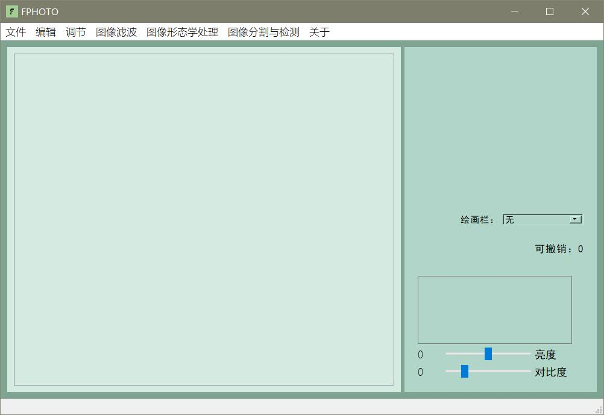

# FPHOTO

- [Gitee](https://gitee.com/fingsinz/fphoto)
- [Github](https://github.com/Fingsinz/FPHOTO)

#### 介绍/Introduction

一个由Visual Studio2022开发的基础图像处理软件，包含：

1. 实现对图像文件的打开、显示、保存、退出等功能；
2. 实现对图像文件的放大、缩小、旋转、翻转、反色、灰度化、裁剪等功能；
3. 实现对图像文件的直方图统计和绘制，直方图均衡等功能；
4. 实现对图像文件的可调整邻域大小的平滑和锐化滤波等功能；
5. 实现对图像文件的膨胀、腐蚀、开运算、闭运算等功能；
6. 实现对图像文件的点、线、边缘检测等功能；
7. 实现对图像文件的给定阈值分割、全局自动阈值分割、OTSU、区域生长等功能；
8. 实现在图像文件上添加直线、矩形、圆、字符、文字等功能；

A basic image processing software developed by Visual Studio2022 that includes:

1. Realize the functions of opening, displaying, saving and exiting image files;
2. Zoom in, zoom out, rotate, flip, reverse color, grayscale, crop and other functions of image files;
3. Achieve histogram statistics and drawing of image files, histogram balancing and other functions;
4. To achieve the image file can adjust the size of the neighborhood smoothing and sharpening filtering functions;
5. To achieve image file expansion, corrosion, open operation, close operation and other functions;
6. To realize the image file point, line, edge detection and other functions;
7. To achieve the image file of the given threshold segmentation, global automatic threshold segmentation, OTSU, regional growth and other functions;
8. To add lines, rectangles, circles, characters, text and other functions on image files;